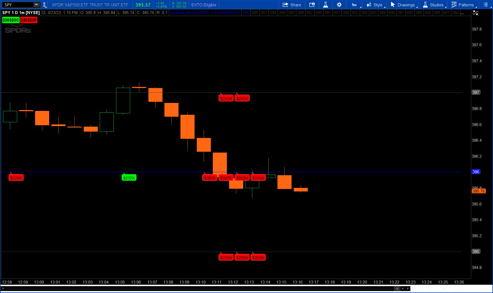
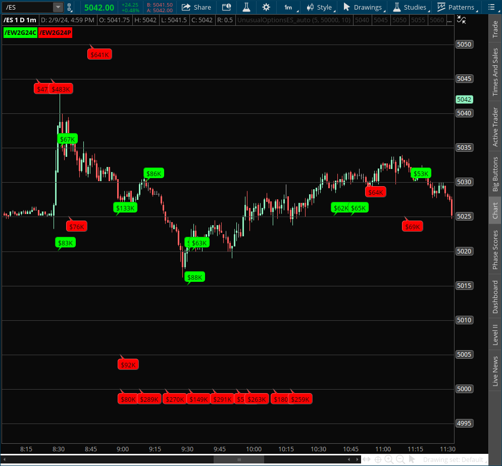
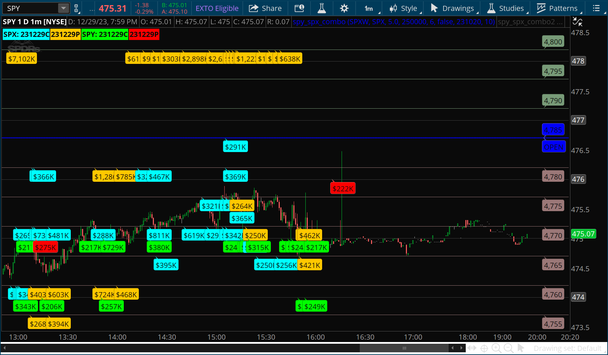
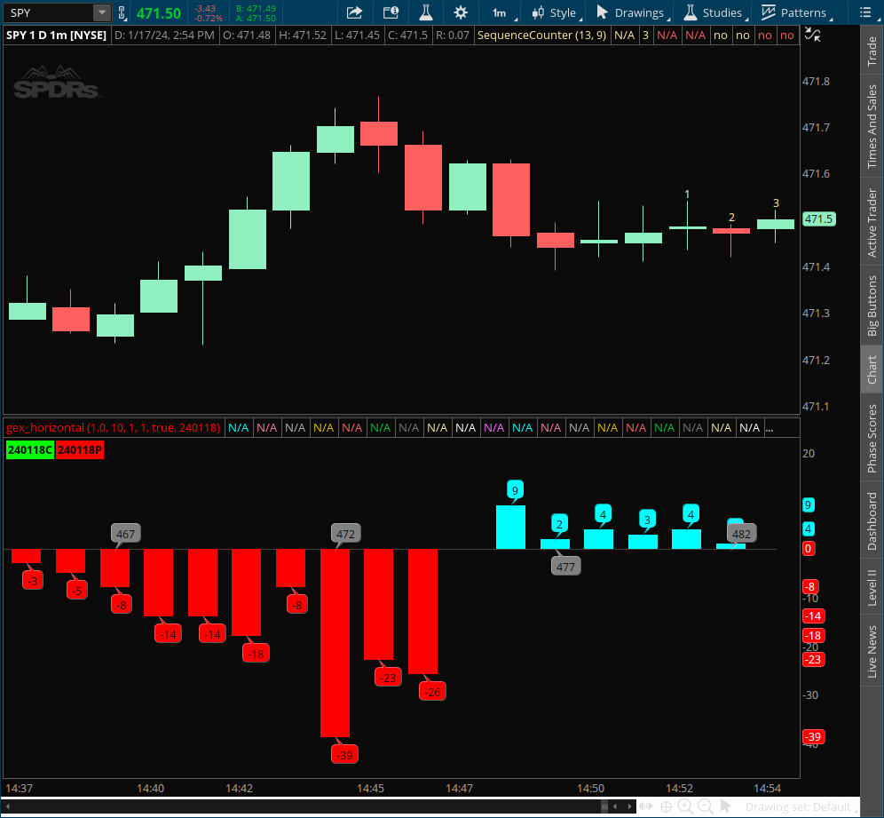
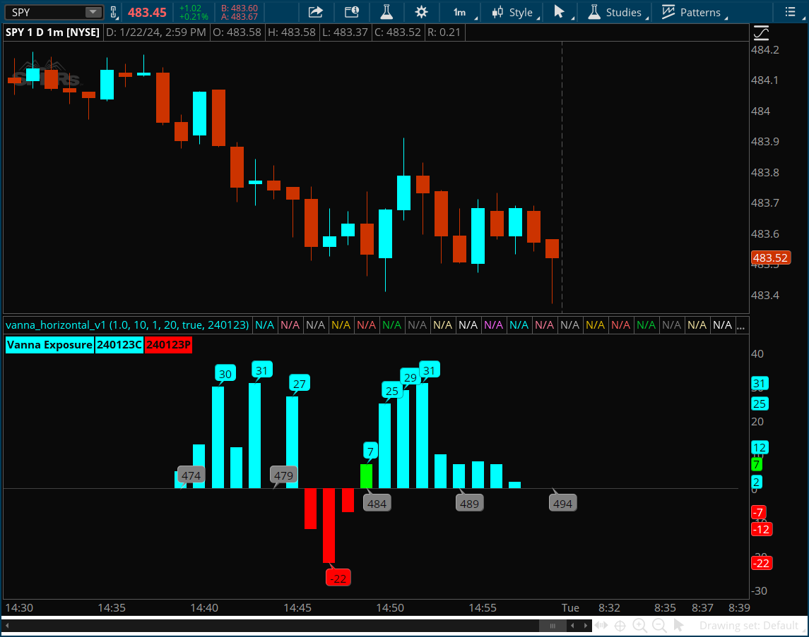
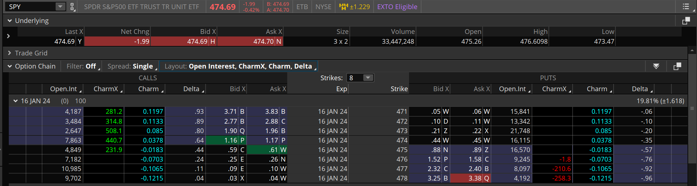
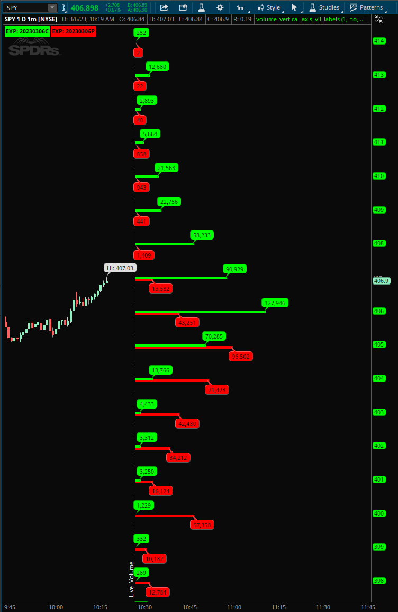
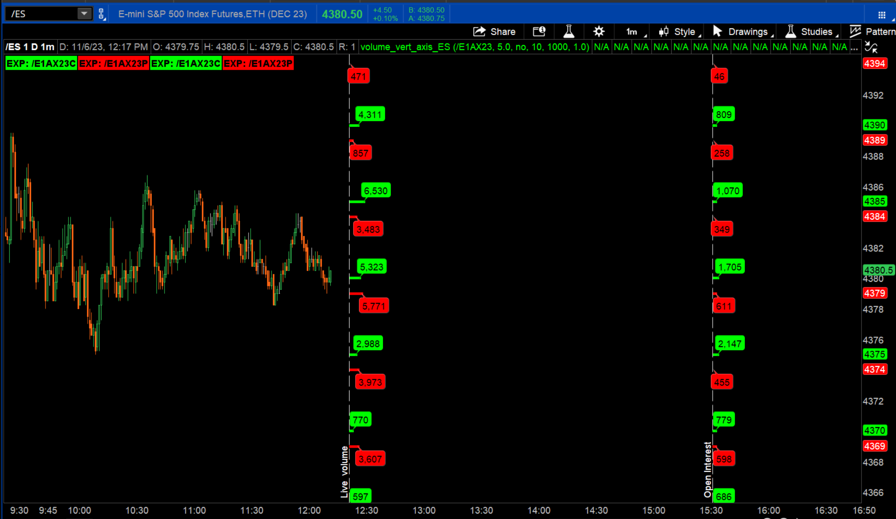

# ThinkScript

# Indicators and Strategies

  Clicking an image links to the code

<!-- TABLE OF CONTENTS -->

  
Table of Contents

  <ol>
 <li>
   [Unusual Options](#unusual-options)
    <ul>
   <li>[Equities](#equities)</li>
   <li>[Futures](#futures)</li>
   <li>[SPY-SPX Combo](#spy-spx-combo)</li>
   <li>[Volume Only](#volume-only)</li>
   </ul>
 </li>
 <li>
   [Greeks](#greeks)
    <ul>
   <li>[Gamma](#gamma)</li>
   <li>[Vanna](#vanna)</li>
   <li>[Charm](#charm)</li>
   </ul>
 </li>
 <li>
   [Open Interest and Option Volume](#open-interest-volume)
   <ul>
  <li>[Open Interest](#open-interest)</li>
  <li>[Option Volume](#option-volume)</li>
   </ul>
 </li>
 <li>[Contributors](#contributors)</li>
 <li>[Contact](#contact)</li>
 <li>[Acknowledgments](#acknowledgments)</li>
  </ol>

## Unusual Options

### Equities

### Futures

### SPY-SPX Combo

### Volume Only

[Volume Only](https://github.com/2187Nick/thinkscript/blob/main/unusual_options_new/unusual_volume_only)

## Greeks

### Gamma

### Vanna

### Charm

([back to top](#readme-top))

## Open Interest and Option Volume

### Open Interest

### Option Volume

([back to top](#readme-top))

## Installation

### How to add indicators to TOS

[Instructions](https://github.com/2187Nick/thinkscript/blob/main/Instructions.md)

### Clone the repo
